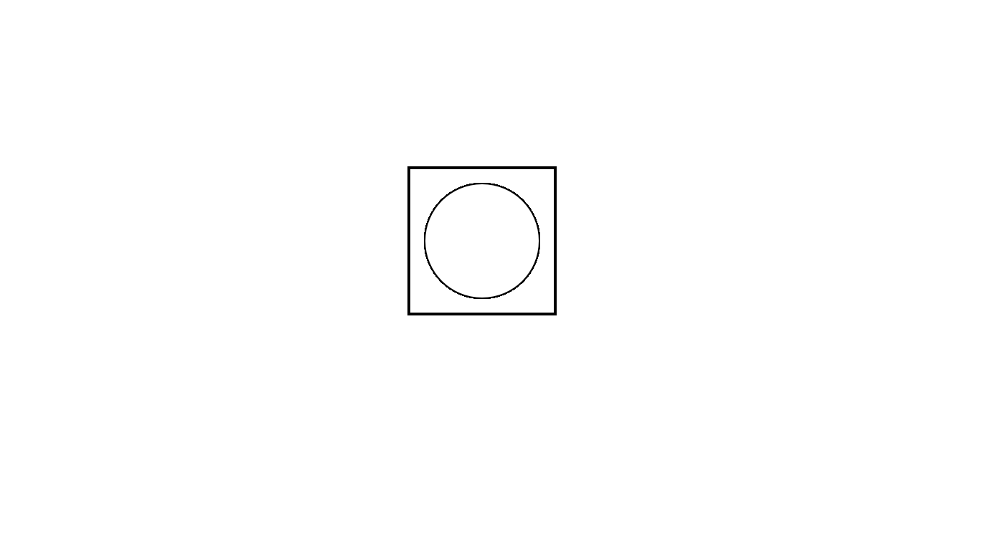
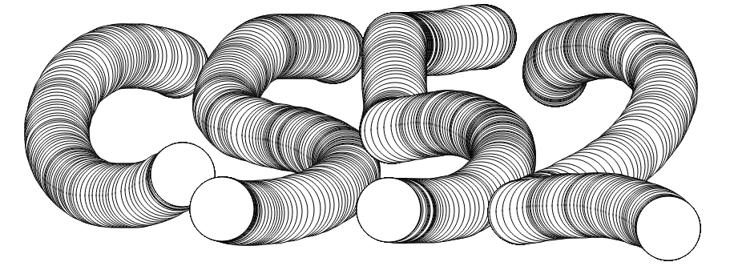
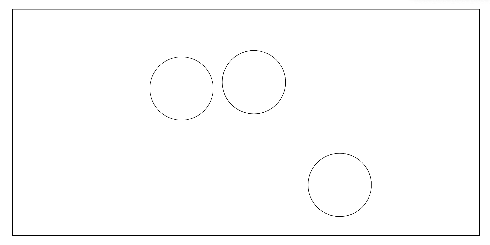
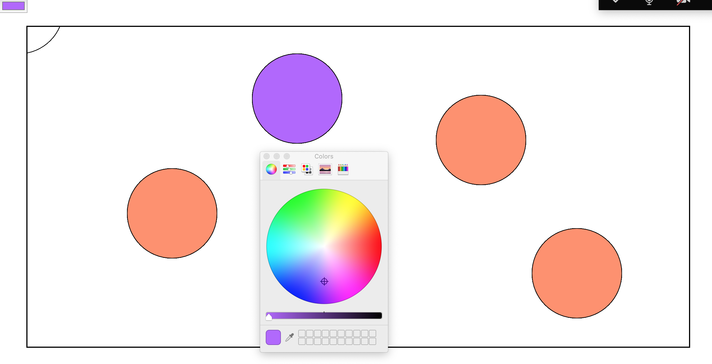
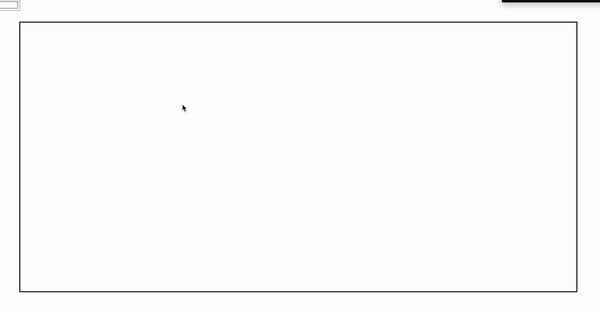
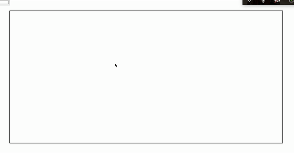
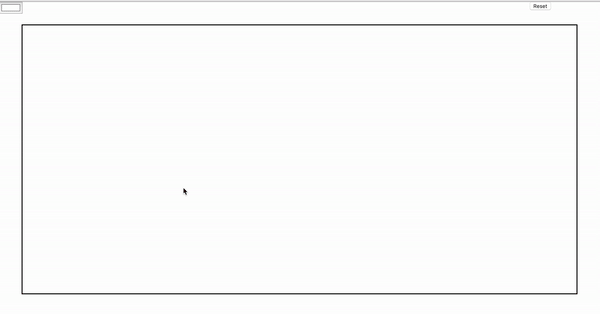

# CS52 Workshops: Interactive Graphics with p5.js 


Let us learn to use `p5.js`, a free and open-source JavaScript library for building interactive graphic applications! As a direct successor of [`Processing.js`](http://processingjs.org/), `p5.js` excels in providing many intuitive modules for creating interactive digital art with minimal setup, all in JavaScript!

## Overview

This tutorial will first teach you the basics of `p5.js`, and then guide you through building an interactive game easily embedded in your own web page.

## Setup

No downloading necessary! Told you - minimal setup.

## Step by Step

### The Basics

1. Create `sketch.js` with the two blank functions as follows:

    ```javascript =
    function setup() {

    }

    function draw() {

    }
    ```

	  `Sketch.js` is where we will code all the `p5.js` magic.
	
1. Quick, draw a circle! Put `ellipse(50, 50, 80, 80);` in your `draw()` function. Go check out your web page. Beautiful, isn't it? That box around the circle  the `<canvas>` element. p5.js uses the `<canvas>` element to sketch to your heart's content.


1. I know, I know: drawing circles is boring. Let's make the users draw them for us instead. Let's put the following in `sketch.js`.

    ```javascript =
    const CANVAS_WIDTH = 1000;
    const CANVAS_HEIGHT = 500;

    function setup() {
      createCanvas(CANVAS_WIDTH , CANVAS_HEIGHT);
    }

    function draw() {
      if (mouseIsPressed) {
        ellipse(mouseX, mouseY, 80, 80);
      }
    }
    ```
	
	  Refresh your page and unleash your inner artist. A talented user might make something like this:
	
	  
	
1. Congratulations! You just made your first interactive graphic application! With nothing more than just an `if` statement and 2 function calls. How did it work, though?

	- As it turns out, `setup()` and `draw()` are two special functions for `p5.js`. `setup()` will run exactly once as soon as the application starts; `draw()`, in turn, will be called over and over unless explicitly stopped (e.g. with [`noLoop()`](https://p5js.org/reference/#/p5/noLoop)). There are other special functions that are called automatically, such as [`mouseMoved()`](https://p5js.org/reference/#/p5/mouseMoved). However, you should only call functions that draw shapes directly (e.g. `ellipse()`) inside the `draw()` function.
	
	- You should also admire the convenience of the boolean variable `mouseIsPressed`, which evaluates to `true` whenever the mouse is pressed (by default the left key) and `false` whenever it is not. We also used other automatically updated variables here, namely `mouseX` and `mouseY`.
	
	- Unsurprisingly, `ellipse()` draws an ellipse. Our `draw()` function, in turn, translates to "every time I am called, check if the mouse is currently pressed; if it is, draw an 80-by-80 ellipse centered at its current location."
	

### The Real Deal

1. Now that you have learned the basic layout and types of functions that constitute the majority of a `p5.js` application, it is time to build our masterpiece of the day - an interactive physics simulation (did I say "game?").

1. First thing first, let us start with a clean slate.

    ```javascript =
    let canvas_width; 
    let canvas_height; 
    
    function setup() {
      canvas_width = windowWidth-100;
      canvas_height = windowHeight-100;
      createCanvas(canvas_width, canvas_height);
    }

    function draw() {
    
    }
    ```
    
    Notice anything different? This time, we let the application begin with a canvas a tad smaller than the browser window - `windowWidth` and `windowHeight` are special variables just for this kind of shenanigan. Question: can we do `let canvas_width = windowWidth - 100` outside `setup()`?
    
1. Anyone here likes object-oriented programming? Anyone remembers the blobs from CS 10? Let's make a `Ball` class. Add it to your `sketch.js`!

    ```javascript =
    class Ball {
      constructor(pos, rad) {
        this.pos = pos;
        this.rad = rad;
      }
      draw_ball() {
        ellipse(this.pos.x, this.pos.y, 2*this.rad, 2*this.rad);
      }
    }
    ```
    
    You will be dealing with a bunch of them, so keep track of them in an array `let balls = [];`! Question: which scope should it be in?
    
    Now, add a mouse click event that creates a ball right where the user clicks our mouse. To do this, p5.js has a great function called `mouseClicked()` that is called every time a mouse click is detected. Add this function to your sketch.js.
    
    ```javascript =
    function mouseClicked() {
      let ball = new Ball(createVector(mouseX, mouseY), 80);
      balls.push(ball);
    }
    ```
    
    To actually visualize the balls, change your `draw()` function to loop through the list of balls and draw each one.
    
    ```javascript =
    function draw() {
      for(let i = 0; i < balls.length; i++) {
        let ball = balls[i];
        ball.draw_ball();
      }
    }
    ```
    
    At this point, your `sketch.js` should look this.
		
    <details>
      <summary>Click to expand</summary>
    
      ```javascript =
      let canvas_width; 
      let canvas_height; 
      let balls = [];

      function setup() {
        canvas_width = windowWidth-100;
        canvas_height = windowHeight-100;
        createCanvas(canvas_width, canvas_height);
      }

      function draw() {
        for(let i = 0; i < balls.length; i++) {
          let ball = balls[i];
          ball.draw_ball();
        }
      }

      function mouseClicked() {
        let ball = new Ball(createVector(mouseX, mouseY), 80);
        balls.push(ball);
      }

      class Ball {
        constructor(pos, rad) {
          this.pos = pos;
          this.rad = rad;
        }
        draw_ball() {
          ellipse(this.pos.x, this.pos.y, 2*this.rad, 2*this.rad);
        }
      }
      ```
    
    </details>
    
    
    
    
    
1. These plain white balls are pretty boring, so let's add some pop! `p5.js` has a nice way of handling color selection called a `colorPicker`. In your list of variables at the top, add a new line `let colorPicker;`

    In your `setup()`, instantiate the color picker by calling:
    
    ```javascript =
    colorPicker = createColorPicker('#FFFFFF');
    colorPicker.position(0, 0);
    ```
    
    This will create the colorPicker at the top left of your screen with the color "white" (`#FFFFFF`). Clicking on the `colorPicker` brings up a new window where the user can select a new color.
    
    Every time the user clicks to create a new `ball`, we want to fill it with the color specified by the `colorPicker`. To do this, add a new instance variable to your Ball constructor: `this.color = color;`. Don't forget to add `color` as a parameter as well.
    
    Then, in your `draw_ball()` function, add `fill(this.color);` before the `ellipse()` function.
    
    This will set the fill color of the ellipse to the color of the `ball`. But how do we set the color of the `ball` in the first place? Hint: we just made a new instance variable.
    
    <details>
      <summary>Click to reveal answer</summary>
      
      We want to set it to the color of the `colorPicker` when the mouse is clicked, so in the `mouseClicked()` change the Ball instantiation line to:
      ```
      let ball = new Ball(createVector(mouseX, mouseY), 80, colorPicker.color());
      ```
    
    </details>
    
    Cool! Now you should be able to make balls of various colors. Try it!
    
    
    
    (Did you notice a sneaky ball on the top left? What might be causing that?)
    
1. Now, let's start implementing some simple physics!

    We will use simplified 2D physics concepts to apply gravitational and collision forces to the balls. `p5.js` has a great implementation of [`Vectors`](https://p5js.org/reference/#/p5.Vector) that make this process very simiple.
    
    What's a `Vector`, you ask? It is simply a `p5.js` class for representing a, well, vector! You know, the ones from physics? An object of this class stores the components of a physics vector in its instance variables (e.g. `Vector.x`) and grants us access to convenient methods for doing vector-based calculation, such as [`Vector.sub()`](https://p5js.org/reference/#/p5.Vector/sub).
    
    Let's start with the gravitational force. 
    
    First, in your `Ball` constructor, add two new instance variables, `vel` (velocity) and `acc` (acceleration). Your constructor should look like this:
    
    ```javascript =
    constructor(pos, rad, color) {
      this.color = color;
      this.pos = pos;
      this.rad = rad;
      this.vel = createVector(0,0);
      this.acc = -9.8;
    }
    ```
    
    Next, in your `draw()` function, add the following lines after where you draw the `ball`.
    
    ```javascript =
    ball.pos.sub(ball.vel);
    ball.vel.y += ball.acc*deltaTime/1000;
    ```
    
    The `deltaTime` variable is a handy variable provided by `p5.js` that gives us the time interval between the current call and the last call of `draw()` in milliseconds.
    
    At this point, if the user creates a `ball`, it should drop to the ground. However, you'll notice that every frame seems to create a new ball, rather than changing the position of the original ball. To fix this, simply call [`clear()`](https://p5js.org/reference/#/p5/clear) at the very beginning of your `draw()` function.

    Great - now your balls bend to gravity's will.
    
    
1. Next, let's handle colllisions, including `ball`-to-`ball` collision as well as `ball`-to-border collisions.
    
    First, create a new function:
    ```javascript = 
    function check_ball_collisions() {
      for(let i = 0; i < balls.length; i++) {
        let ball1 = balls[i];
        
        if(ball1.pos.y > canvas_height - ball1.rad) {
          ball1.vel.y *= -0.8;
          ball1.pos.y = canvas_height - ball1.rad; 
        }
      }
    }
    ```
    
    This function checks to see if any of the balls you've created are in contact with the "floor" of the canvas. If any do, we invert their y-velocity and dampen it by a factor of 0.8.
    
    Next, call this function at the very end of your `draw()` method. Now, your balls should bounce off the floor!
    Notice how the balls will bounce infinitely. This is because the multiplication of y-velocities will never reach 0. We can solve this easily but inelegantly with the following line added.
    ```javascript = 
    function check_ball_collisions() {
      for(let i = 0; i < balls.length; i++) {
        let ball1 = balls[i];

        if(ball1.pos.y > canvas_height - ball1.rad) {
          if(abs(ball1.vel.y) < 1.5) {
            ball1.vel.y = 0;
          }
          ball1.vel.y *= -0.8;
          ball1.pos.y = canvas_height - ball1.rad; 
        }
      }
    }
    ```
    
    Next, let's handle `ball`-to-`ball` collisions. This involves some physics knowledge, so the code for it is provided below. Notice the extensive usage of `Vector`, and how nicely `p5.js` handles `Vector` arithmetic.
    Change your `check_ball_collisions()` function to the following:
    
    <details>
      <summary>Click to expand</summary>

      ```javascript = 
      function check_ball_collisions() {
        for(let i = 0; i < balls.length; i++) {
          let ball1 = balls[i];
          for(let j = i+1; j < balls.length; j++) {
            let ball2 = balls[j];
            // Two balls collide if the distance between them is less than the sum of the radii
            let dist = ball1.pos.dist(ball2.pos);
            if(dist < ball1.rad + ball2.rad) {
            // If balls overlap, correct for the overlap
              let desired_dist = ball1.rad + ball2.rad;
              let error = desired_dist - dist;
              let ball1_fix = (ball1.rad/desired_dist) * error;
              let ball2_fix = (ball2.rad/desired_dist) * error;

              let v = p5.Vector.sub(ball1.pos, ball2.pos);

              let ball1_vec = p5.Vector.mult(v, ball1_fix/dist);
              let ball2_vec = p5.Vector.mult(v, ball2_fix/dist);

              ball1.pos.add(ball1_vec);
              ball2.pos.sub(ball2_vec);

              // Calculate the new velocities of each ball based on simplified 2D physics
              let a1 = p5.Vector.sub(ball1.vel, ball2.vel);
              let b1 = p5.Vector.sub(ball1.pos, ball2.pos);
              let c1 = b1.magSq();
              let d1 = p5.Vector.dot(a1, b1);
              let vel_1 = p5.Vector.sub(ball1.vel, p5.Vector.mult(b1, d1/c1));

              let a2 = p5.Vector.sub(ball2.vel, ball1.vel);
              let b2 = p5.Vector.sub(ball2.pos, ball1.pos);
              let c2 = b2.magSq();
              let d2 = p5.Vector.dot(a2, b2);
              let vel_2 = p5.Vector.sub(ball2.vel, p5.Vector.mult(b2, d2/c2));

              // Set the new velocities for each ball
              ball1.vel = vel_1;
              ball2.vel = vel_2;
            }
          }

          // For each ball, also check for collisions against the floor and the walls
          // The -0.8 multiplier is to dampen the speed of the ball when colliding with walls or the floor
          if(ball1.pos.y > canvas_height - ball1.rad) {

            // This if-statement prevents infinite bouncing
            if(abs(ball1.vel.y) < 1.5) {
              ball1.vel.y = 0;
            }
            ball1.vel.y *= -0.8;
            ball1.pos.y = canvas_height - ball1.rad; // Correct overlap
          }
        }
      }
      ```
      
    </details>
    

    Now your balls should be bouncing off one another! Again, note the use of `Vector` functions such as
    * `dot()`
    * `sub()`
    * `mag()`
    * `dist()`

    `p5.js` has all these functions built-in, making manipulating vectors very easy!
    
    Bouncing the balls off the walls of the canvas uses the same exact principles as bouncing them off the floor. In your `check_ball_collisions()`, change the `if` statement checking for floor collisions to the following.
    
    ```javascript =
    if(ball1.pos.y > canvas_height - ball1.rad) {

      // This if-statement prevents infinite bouncing
      if(abs(ball1.vel.y) < 1.5) {
        ball1.vel.y = 0;
      }

      ball1.vel.y *= -0.8;
      ball1.pos.y = canvas_height - ball1.rad; // Correct overlap
    } else if(ball1.pos.x > canvas_width - ball1.rad) {
      ball1.vel.x *= -0.8
      ball1.pos.x = canvas_width - ball1.rad; // Correct overlap
    } else if(ball1.pos.x < ball1.rad) {
      ball1.vel.x *= -0.8
      ball1.pos.x = ball1.rad; // Correct overlap
    }
    ```

	  Now, let's utilize other cool functions that `p5.js` provides us. Specifically, we'll use the functions `mousePressed()`, `mouseReleased()`, and `mouseDragged()`.
	
	  Replace your `mouseClick()` function with the following 3 functions:
	
    ```javascript =
    function mousePressed() {
      if(mouseX > 0 && mouseX < canvas_width && mouseY > 0 && mouseY < canvas_height) {
        let rad = 10;
        let ball = new Ball(createVector(mouseX, mouseY), rad, colorPicker.color());
        balls.push(ball);
      }
    }

    // When mouse is released, apply gravitational force to newly made ball
    function mouseReleased() {
      let ball = balls[balls.length - 1];
      ball.building = false;
      ball.acc = GRAVITY;
    }

    // Change position of ball while it is being created
    function mouseDragged() {
      let ball = balls[balls.length - 1];
      if(ball.building) {
        ball.pos.x = mouseX;
        ball.pos.y = mouseY;
      }
    }
    ```
	
	  Then, in your `ball` constructor, add a new instance variable `this.building = true;`
	
	  Also in the constructor, change the value of `acc` to 0. This will ensure that the ball stays in place as it is being created.
    
	  Next, in `draw()` after where you update the `pos` and `vel` of the `ball`, add the following lines:

    ```javascript =
    if(ball.building) {
      ball.rad += 0.5;
    }
    ```
  
    Finally, at the top of your `sketch.js`, add `const GRAVITY = -9.8;`. 
	
    The `ball.building` boolean indicates if the `ball` is currently being created. This will grow and move the `ball` the user creates as they hold down the mouse button, and then release it as soon as they release the mouse button. These three mouse functions give you much more control over mouse input than the simple `mouseClick()` function we used earlier.

    Awesome! Now your physics simulation is complete. You should be able to create and drop various balls to see how they bounce off one another in all their hilarity.
    
	
    To finish things off, let's create a simple button to refresh the page. Rather than creating the button in `index.html`, `p5.js` provides great methods to create these `DOM` elements. For buttons, we will be using `createButton()`.
	
    Add the following lines in `setup()` right after your `colorPicker` code.
	
    ```javascript = 
    button = createButton('Reset');
    button.position(canvas_width-50, 0);
    button.mousePressed(reset_canvas);
	  ```
	  
    Then, create this function, which simply resets your ball array:
	  
    ```javascript = 
    function reset_canvas() {
      balls = [];
    }	
	  ```
	
    Notice how `p5.js` not only handles the creation of the button as a `DOM` element, but can also position it and create an event listener. This is super convenient!

    You are done! Hooray!

    
## Summary / What you Learned

* [ ] Understand the basic functions and structure available for a `p5.js` application
* [ ] Completed `The Basics`
* [ ] Finished `The Real Deal`

## Reflection

* [ ] Give some examples of how you might use`p5.js` in web development.
* [ ] What attributes of the `p5.js` library might make it attractive to artists and designers?


## Resources
[p5.js Get Started](https://p5js.org/get-started/)

[p5.js Online Editor](https://editor.p5js.org/)

[2D Physics Formulas](https://opentextbc.ca/physicstestbook2/chapter/collisions-of-point-masses-in-two-dimensions/)

